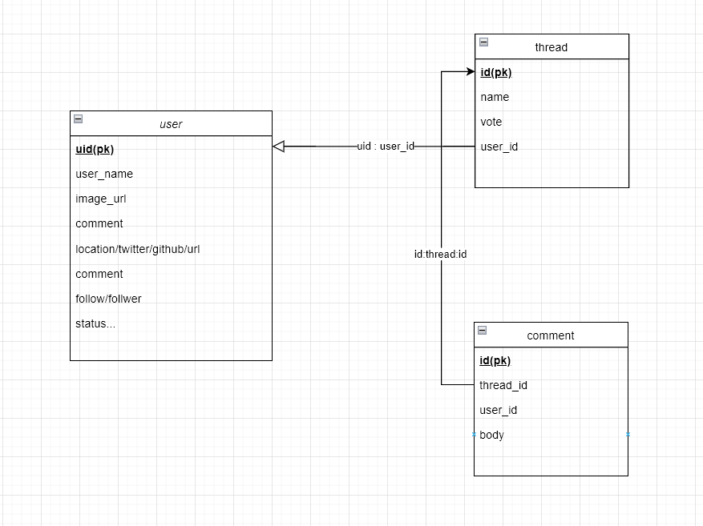

# hack-camp_vol13_server


## API docments
https://d-undefined.github.io/hack-camp_vol13_schema/dist/index.html

## Getting Started
docker start  

```
docker compose up
```


### ER



### API memo

統計情報  
```
GET /api/v1/statistics
```
SumThread ,SumComment ,SumVote  
この3つ

___

上位10名の userを表示 (Scoreを基準とする)  
```
GET /api/v1/users/ranking
```

___

過去１週間の trendのthreadを 10件返す  
```
GET /api/v1/threads/trend
```

___

uid が thread_id に対して 投票してるか  
投票してた場合 model.VoteThreadの型で返す  
```
GET /api/v1/vote_thread/:uid/:thread_id
```

___

thread id でコメント一覧を取得し  
その中でどのコメントにuidが投票したcomment一覧をリストで返す  
投票したcommentがないときは空配列を返す  
```
GET /api/v1/vote_thread/:uid/:thread_id
```

___
